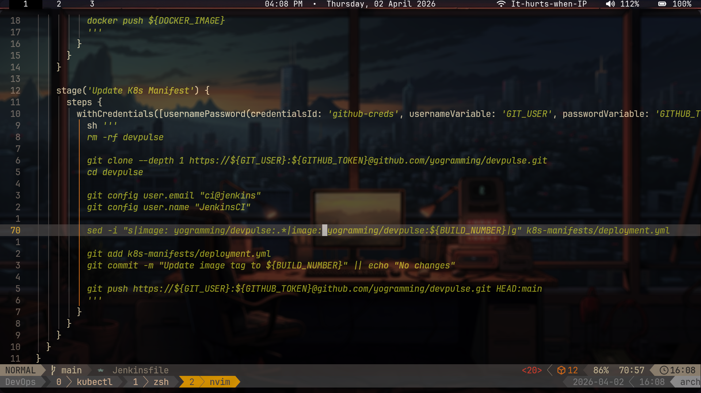
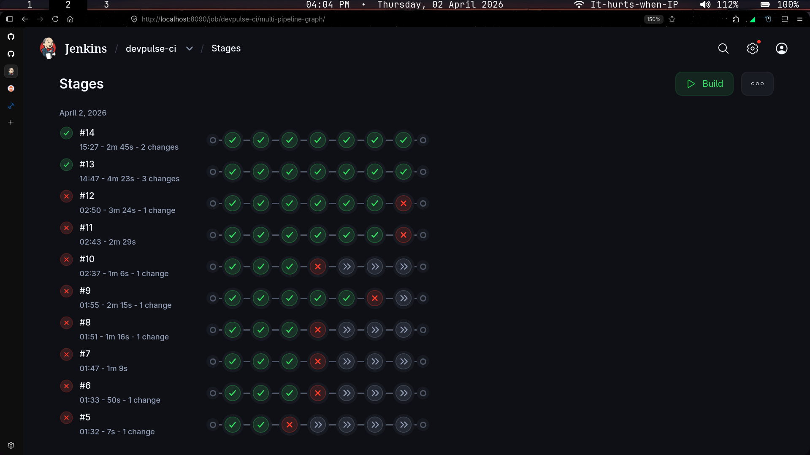
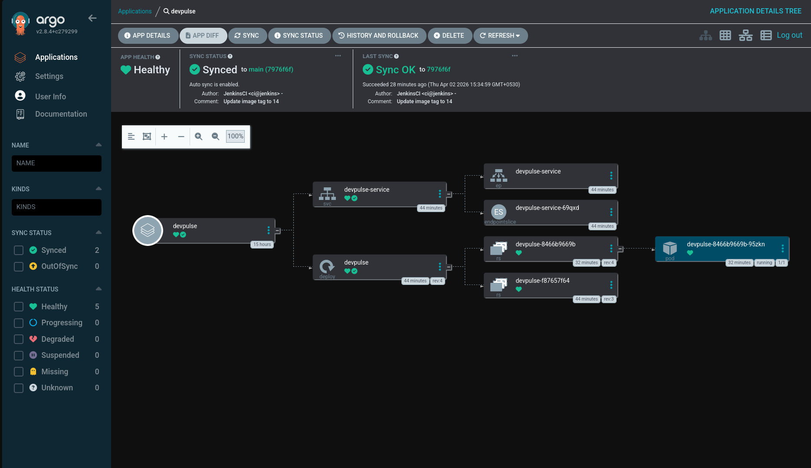
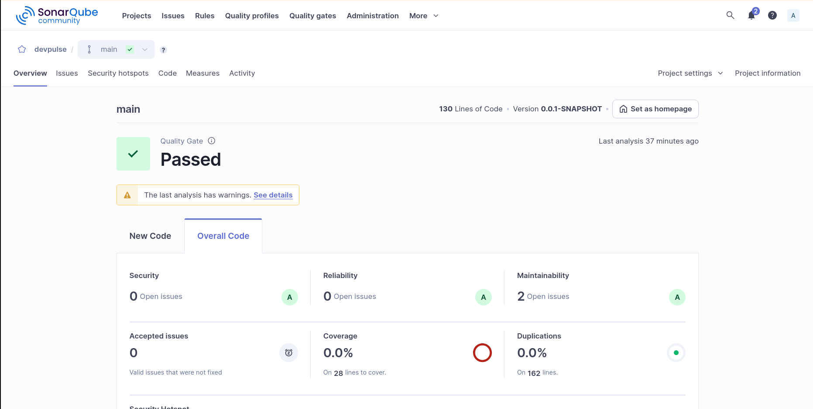

# DevPulse

> A production-grade Spring Boot application for system health monitoring — fully DevOpsified from code to cluster.

---

<div align="center">
  
  &nbsp;
  
</div>

<div align="center">
  
  &nbsp;
  
</div>

## What is DevPulse?

**DevPulse** is a Spring Boot application that exposes system health metrics and status checks. Beyond the application itself, this project is a full end-to-end DevOps pipeline demonstration — from a developer pushing code to a running, monitored deployment in Kubernetes.

---

## Tech Stack

### Application

- **Java** + **Spring Boot** — REST API for system health checks
- **Maven** — Build tool and dependency management

### CI/CD Pipeline

- **Jenkins** — Orchestrates the full pipeline via `Jenkinsfile`
- **Webhooks** — Triggers Jenkins builds automatically on every `git push`
- **SonarQube** — Static code analysis and quality gate enforcement
- **Docker** — Containerizes the application
- **Helm Charts** — Kubernetes deployment packaging and versioning
- **ArgoCD** — GitOps-based continuous delivery to Kubernetes

### Infrastructure

- **Kubernetes** — Container orchestration and runtime
- **Docker Hub / Registry** — Image storage

### Notifications

- **Email Alerts** — Automated notifications on pipeline success or failure

---

## CI/CD Pipeline Overview

```
Developer pushes code
        │
        ▼
  GitHub Webhook
        │
        ▼
    Jenkins Job
   ┌────────────────────────────────────┐
   │  1. Checkout source code           │
   │  2. Maven build & unit tests       │
   │  3. SonarQube code analysis        │
   │  4. Quality gate check             │
   │  5. Docker image build & push      │
   │  6. Update Helm chart values       │
   │  7. Push to GitOps repo            │
   │  8. Email alert (pass/fail)        │
   └────────────────────────────────────┘
        │
        ▼
    ArgoCD detects
    Helm chart change
        │
        ▼
  Kubernetes Deployment
  (Rolling update / sync)
```

---

## Getting Started

### Prerequisites

- Java 17+
- Maven 3.8+
- Docker
- Kubernetes cluster (Minikube / cloud)
- Helm 3+
- ArgoCD installed in cluster
- Jenkins with the following plugins:
  - Maven Integration
  - Docker Pipeline
  - SonarQube Scanner
  - Email Extension

### Run Locally

```bash
git clone https://github.com/<your-username>/devpulse.git
cd devpulse
mvn spring-boot:run
```

Visit: `http://localhost:8080/actuator/health`

### Build Docker Image

```bash
docker build -t devpulse:latest .
docker run -p 8080:8080 devpulse:latest
```

### Deploy with Helm

```bash
helm install devpulse ./helm/devpulse \
  --namespace devpulse \
  --create-namespace
```

---

## Jenkins Pipeline

The `Jenkinsfile` at the root defines the full declarative pipeline. Stages:

| Stage                 | Description                                    |
| --------------------- | ---------------------------------------------- |
| `Checkout`            | Clones the repository                          |
| `Build`               | `mvn clean package`                            |
| `Test`                | Runs unit tests via Maven                      |
| `SonarQube Analysis`  | Scans code quality and coverage                |
| `Quality Gate`        | Fails the pipeline if gate not passed          |
| `Docker Build & Push` | Builds image, pushes to registry               |
| `Update Helm Values`  | Bumps image tag in `values.yaml`               |
| `Email Notification`  | Sends pass/fail alert to configured recipients |

Webhook is configured on the GitHub repository to trigger this pipeline on every push to `main`.

---

## ArgoCD GitOps

ArgoCD watches the Helm chart repository for changes. When Jenkins updates the image tag in `values.yaml` and pushes to the GitOps repo, ArgoCD automatically syncs the new deployment to the cluster.

```
GitOps Repo (Helm values updated by Jenkins)
        │
        ▼
    ArgoCD App
        │
        ▼
  Kubernetes Deployment
  (zero-downtime rolling update)
```

---

## Email Alerts

Jenkins is configured with the **Email Extension Plugin** to send alerts on:

- ✅ **Build Success** — Tests passed, image deployed
- ❌ **Build Failure** — Stage that failed, logs attached

Configure recipients in `Jenkinsfile`:

```groovy
post {
    success {
        emailext subject: "✅ DevPulse Build #${env.BUILD_NUMBER} Passed",
                 body: "Pipeline succeeded. New image deployed to Kubernetes.",
                 to: "your-email@example.com"
    }
    failure {
        emailext subject: "❌ DevPulse Build #${env.BUILD_NUMBER} Failed",
                 body: "Pipeline failed at stage: ${env.STAGE_NAME}. Check logs.",
                 to: "your-email@example.com"
    }
}
```

---

## Health Check Endpoints

| Endpoint                | Description                |
| ----------------------- | -------------------------- |
| `GET /actuator/health`  | Overall application health |
| `GET /actuator/metrics` | JVM and system metrics     |
| `GET /actuator/info`    | Application info           |

---

## Author

**Yogramming**
— DevOps & Cloud Native enthusiast

---

> _"Ship it, monitor it, automate everything in between."_
